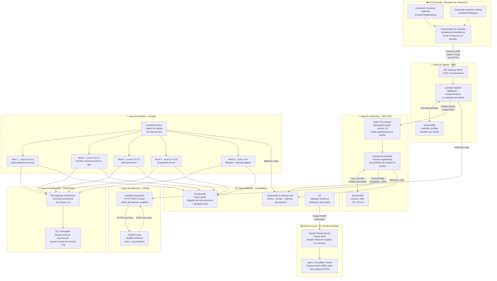

# Arquitectura Híbrida AWS — PoC Detección de Vishing en Tiempo Real


---

## Diagrama de arquitectura (alto nivel)



---

## Principio de diseño de la arquitectura híbrida

La arquitectura híbrida mantiene en AWS de ingesta, streaming, orquestación y notificación, y mueve a entorno local los componentes de mayor costo que no aportan valor diferencial a la demo.

El resultado es una reducción de costo mensual sin comprometer ningún aspecto visible del flujo de demostración.

| Decisión | Componente movido | Justificación |
|---|---|---|
| AWS → Local | Inferencia del modelo (SageMaker) | Mayor costo, reemplazable por FastAPI local sin impacto en el demo |
| Kinesis → SQS FIFO | Streaming de eventos | SQS FIFO garantiza orden por sesión a costo marginal |
| ElastiCache → DynamoDB TTL | Estado de sesión | Latencia de 5–10ms suficiente para sesiones de minutos |
| EC2 → EC2 (se mantiene) | Simulador de telemetría | Demostracion infra on-cloud |

---

## Descripción de componentes

### 1. Simulador de telemetría · EC2 t3.small

**Propósito:** Reemplaza el SDK de BioCatch y los logs de la app MiBancolombia. Genera eventos de sesión en tiempo real, enviándolos evento por evento al API Gateway con los delays naturales de una sesión humana real.

**Por qué se mantiene en EC2:** A diferencia de los otros componentes de cómputo, el simulador necesita correr sesiones de hasta 30 minutos de forma continua y orquestar múltiples sesiones en paralelo. Lambda tiene un timeout máximo de 15 minutos, lo que lo descarta para este rol. EC2 t3.small es la instancia más económica que soporta este comportamiento sin restricciones, y su presencia en la arquitectura demuestra capacidad de despliegue de servicios de larga duración en la nube.

**Estructura del simulador:**

```
simulator/
├── orchestrator.py       # Lanza y coordina N sesiones en paralelo (threading)
├── legitimate.py         # Genera sesiones con comportamiento normal
├── vishing.py            # Genera sesiones con patrones de manipulación
├── profiles.py           # Carga perfiles de cliente desde S3 o DynamoDB
└── websocket_client.py   # Mantiene conexión WebSocket para recibir intervenciones
```

**Comportamiento del orquestador para el demo:**

```python
# orchestrator.py — ejemplo simplificado
import threading, time

sessions = [
    {"type": "legitimate", "customer_id": "BC-10023"},
    {"type": "vishing",    "customer_id": "BC-10041"},
    {"type": "legitimate", "customer_id": "BC-10057"},
    {"type": "vishing",    "customer_id": "BC-10089"},
]

threads = [threading.Thread(target=run_session, args=(s,)) for s in sessions]
for t in threads:
    t.start()
    time.sleep(2)  # Offset para que no arranquen todas al mismo tiempo
```

**Estructura del evento JSON enviado por cada sesión:**

```json
{
  "session_id": "3f2a1b4c-...",
  "customer_id": "BC-10041",
  "timestamp": "2025-03-15T14:32:07.341Z",
  "event_type": "biometric_sample | screen_view | transaction_intent",
  "biometric": {
    "acelerometro_varianza_x": 0.041,
    "acelerometro_varianza_y": 0.037,
    "velocidad_tecleo_ms": 312,
    "presion_tactil": 0.71,
    "num_pausas_largas_acumuladas": 6,
    "ratio_backspace": 0.18
  },
  "navigation": {
    "pantalla_actual": "IngresoMonto",
    "tiempo_en_pantalla_seg": 47,
    "num_correcciones_campo_monto": 3,
    "app_en_background_antes": true,
    "tiempo_background_seg": 22
  },
  "transaction": {
    "monto_cop": 4500000,
    "es_destinatario_nuevo": true,
    "tiempo_cuenta_destino_dias": 8
  }
}
```

---

### 2. Capa de ingesta · API Gateway REST + Lambda Ingestor + DynamoDB

**API Gateway REST** expone el endpoint `POST /session/event` que recibe los eventos del simulador en EC2. Protegido con API key para que solo el simulador autorizado pueda enviar eventos.

**Lambda Ingestor** ejecuta tres operaciones en secuencia por cada evento recibido:

1. Valida el schema del evento (campos requeridos, tipos de datos, rango de timestamps)
2. Consulta DynamoDB `customer_profiles` para recuperar el baseline del cliente
3. Calcula desviaciones relativas al baseline y enriquece el evento antes de publicarlo en SQS

Las desviaciones calculadas en este paso son features clave del modelo:

```python
# Enriquecimiento en Lambda Ingestor
desviacion_tecleo = (evento["biometric"]["velocidad_tecleo_ms"]
                     - perfil["velocidad_tecleo_promedio_ms"]) \
                    / perfil["velocidad_tecleo_std_ms"]

desviacion_tiempo_sesion = (estado_sesion["tiempo_total_seg"]
                            - perfil["duracion_sesion_promedio_seg"]) \
                           / perfil["duracion_sesion_promedio_seg"]

es_horario_tipico = (perfil["hora_inicio_tipica_from"]
                     <= hora_actual
                     <= perfil["hora_inicio_tipica_to"])
```

**DynamoDB — tabla `customer_profiles`** se pre-carga desde los datasets sintéticos antes de cada demo. Contiene el baseline de comportamiento de cada cliente generado en la fase de preparación de datos.

```
customer_profiles (PK: customer_id)
├── velocidad_tecleo_promedio_ms     → float
├── velocidad_tecleo_std_ms          → float
├── duracion_sesion_promedio_seg     → float
├── duracion_sesion_std_seg          → float
├── pantallas_top5                   → List<String>
├── hora_inicio_tipica_from          → int (0–23)
├── hora_inicio_tipica_to            → int (0–23)
├── monto_promedio_historico_cop     → float
└── num_sesiones_historico           → int
```

---

### 3. Capa de streaming · SQS FIFO

**Por qué SQS FIFO en lugar de Kinesis Data Streams:**

Kinesis cobra por shard-hora con independencia del uso (~$11 por shard al mes). Para una PoC con pocas sesiones concurrentes, ese costo fijo no se justifica. SQS FIFO garantiza el mismo principio clave — orden de mensajes por sesión — usando `MessageGroupId: session_id`, y cobra únicamente por mensaje procesado (~$0.40 por millón de mensajes).

Para una demo con 5–10 sesiones simultáneas el costo de SQS es efectivamente $0. El límite de 300 transacciones por segundo por MessageGroupId es más que suficiente para la PoC.

**Lambda Procesador** consume de SQS FIFO y ejecuta el feature engineering acumulativo de la sesión:

- Lee el estado actual de la sesión desde DynamoDB `session_state`
- Actualiza el estado con los datos del evento recibido
- Escribe el estado actualizado de vuelta en DynamoDB con TTL renovado
- Si el evento es de tipo `transaction_intent`, construye el vector de features completo y llama al modelo

**DynamoDB — tabla `session_state`** reemplaza a ElastiCache Redis. Almacena el estado acumulado de cada sesión activa con un TTL de 60 minutos. La latencia de 5–10ms por operación de lectura/escritura es imperceptible en el contexto de sesiones que duran varios minutos.

```
session_state (PK: session_id)
├── num_pausas_largas                → int
├── tiempo_total_seg                 → float
├── pantallas_visitadas              → List<String>
├── num_correcciones_monto           → int
├── app_background_count             → int
├── biometric_samples_recientes      → List<Map>   (últimas 5 muestras)
├── desviacion_tiempo_vs_baseline    → float
├── desviacion_tecleo_vs_baseline    → float
├── ultimo_evento_ts                 → String (ISO8601)
└── ttl                              → int (Unix timestamp, +3600s)
```

---

### 4. Capa de inferencia · Híbrida (FastAPI local + túnel)

Esta es la modificación central de la arquitectura híbrida y su componente de mayor ahorro (~$50/mes).

**FastAPI model_server en PC local** carga el modelo XGBoost entrenado sobre los datasets sintéticos y expone un endpoint de inferencia en el puerto 8000. El servidor debe estar corriendo antes de iniciar el demo.

```python
# model_server.py
from fastapi import FastAPI
import joblib, numpy as np, time

app = FastAPI()
model = joblib.load("artifacts/vishing_model.pkl")
feature_names = joblib.load("artifacts/feature_names.pkl")

@app.post("/predict")
def predict(features: dict):
    t0 = time.time()
    X = np.array([[features.get(f, 0) for f in feature_names]])
    score = float(model.predict_proba(X)[0][1])
    importances = model.feature_importances_
    top = sorted(zip(feature_names, importances),
                 key=lambda x: -x[1])[:5]
    return {
        "vishing_score": round(score, 3),
        "confidence":    round(max(score, 1 - score), 3),
        "top_features": [
            {"feature": f, "importancia": round(i, 3)}
            for f, i in top
        ],
        "latencia_inferencia_ms": round((time.time() - t0) * 1000, 1)
    }
```

**Túnel público (ngrok o Cloudflare Tunnel)** expone el puerto 8000 local como una URL HTTPS pública que el Lambda Procesador puede llamar desde AWS.

```bash
# Opción A — ngrok (más simple para demos)
ngrok http 8000
# Genera URL tipo: https://a1b2c3d4.ngrok.io
# Esta URL se configura como variable de entorno MODEL_ENDPOINT en Lambda

# Opción B — Cloudflare Tunnel (más estable, sin límite de sesión)
cloudflared tunnel --url http://localhost:8000
```

La URL generada se configura como variable de entorno `MODEL_ENDPOINT` en el Lambda Procesador. Para cambiar de local a SageMaker en el futuro, solo se actualiza esta variable de entorno — el resto del pipeline no cambia.

**Latencia real de inferencia local:** La llamada HTTP desde AWS a través del túnel añade ~50–150ms de latencia de red. Para una PoC esto es completamente aceptable y la latencia end-to-end sigue siendo inferior a 2 segundos.

---

### 5. Capa de decisión · Lambda Decisor

Recibe el output del modelo (a través del Lambda Procesador) y aplica la lógica de intervención graduada. También registra cada decisión en DynamoDB `fraud_alerts` para el feedback loop.

**Lógica de niveles de intervención:**

| Rango de score | Nivel | Acción | Mecanismo |
|---|---|---|---|
| 0.0 – 0.3 | — | Sin intervención | Solo log en CloudWatch |
| 0.3 – 0.5 | Nivel 1 | Alerta silenciosa interna | Registro en `fraud_alerts` + métrica CloudWatch |
| 0.5 – 0.7 | Nivel 2 | Fricción conversacional | Push WebSocket al dispositivo con pregunta contextual |
| 0.5 – 0.7 | Nivel 3 | SMS preventivo | Push WebSocket + log de SMS simulado |
| 0.7 – 0.9 | Nivel 4 | Cooling-off 30 minutos | Push WebSocket con bloqueo temporal |
| > 0.9 | Nivel 5 | Bloqueo + alerta agente | Push WebSocket + registro de escalación |

**Payload enviado al dispositivo:**

```json
{
  "session_id": "3f2a1b4c-...",
  "action": "friction_question",
  "nivel": 2,
  "score": 0.847,
  "mensaje": "Notamos que esta transferencia es inusual para ti. ¿Estás en este momento hablando por teléfono con alguien que te está guiando para hacerla?",
  "top_features": [
    {"feature": "num_pausas_largas",              "valor": 6,    "importancia": 0.28},
    {"feature": "desviacion_tiempo_sesion",        "valor": 2.34, "importancia": 0.21},
    {"feature": "es_destinatario_nuevo",           "valor": true, "importancia": 0.18},
    {"feature": "app_background_count",            "valor": 3,    "importancia": 0.14},
    {"feature": "num_correcciones_monto",          "valor": 3,    "importancia": 0.11}
  ]
}
```

---

### 6. Capa de notificación · API Gateway WebSocket

El simulador en EC2 mantiene una conexión WebSocket abierta por cada sesión activa. Cuando el Lambda Decisor determina una intervención, hace push directo al `connectionId` de esa sesión.

Esta arquitectura push es más impactante para el demo que un esquema de polling porque la intervención aparece en el simulador en tiempo real, sin latencia adicional de consulta, reflejando exactamente cómo funcionaría en la app móvil real.

El WebSocket también sirve como canal de feedback: cuando el simulador recibe una intervención de Nivel 2 (pregunta contextual), puede responder simulando la respuesta del usuario ("Sí, estoy siendo manipulado") para demostrar la escalación automática.

---

### 7. Observabilidad · CloudWatch Dashboard

El dashboard es uno de los elementos más importantes del demo desde la perspectiva de comunicación hacia stakeholders. Convierte el flujo técnico en una narrativa visual comprensible.

**Widgets recomendados:**

- **Sesiones activas en tiempo real:** Gauge por sesión con color por rango de score (verde < 0.5, amarillo 0.5–0.7, rojo > 0.7)
- **Timeline de intervenciones:** Eventos ordenados cronológicamente con nivel, score y session_id
- **Latencia end-to-end:** Percentiles P50 y P95 desde `transaction_intent` hasta notificación WebSocket. Objetivo: < 2 segundos
- **Top features por alerta:** Los 3 features más influyentes de cada intervención activa, para demostrar explicabilidad del modelo
- **Distribución de scores:** Histograma en tiempo real de scores de sesiones activas, mostrando la separación entre clases

---

## Stack completo y comparación de costos

| Componente | Servicio | Arquitectura original | Arquitectura híbrida |
|---|---|---|---|
| Simulador de telemetría | EC2 t3.small | ~$15/mes | ~$15/mes *(se mantiene)* |
| Endpoint de ingesta | API Gateway REST | ~$1/mes | ~$1/mes |
| Ingestor y enriquecimiento | Lambda | ~$1/mes | ~$1/mes |
| Perfiles de cliente | DynamoDB on-demand | ~$1/mes | ~$1/mes |
| Streaming de eventos | Kinesis → **SQS FIFO** | ~$22/mes | **~$0/mes** |
| Feature engineering | Lambda | ~$1/mes | ~$1/mes |
| Estado de sesión | ElastiCache → **DynamoDB TTL** | ~$12/mes | **~$1/mes** |
| Inferencia del modelo | SageMaker → **FastAPI local** | ~$50/mes | **~$0/mes** |
| Lógica de decisión | Lambda | ~$1/mes | ~$1/mes |
| Notificación al dispositivo | API Gateway WebSocket | ~$1/mes | ~$1/mes |
| Registro de alertas | DynamoDB on-demand | ~$1/mes | ~$1/mes |
| Observabilidad | CloudWatch | ~$5/mes | ~$5/mes |
| Almacenamiento | S3 | ~$1/mes | ~$1/mes |
| **Total** | | **~$112/mes** | **~$28/mes** |

> **Reducción de costo: 75%** manteniendo el mismo valor de demostración end-to-end.

---

## Fases de implementación

### Fase 1 — Esqueleto de ingesta · Semana 1

**Objetivo:** Validar que el flujo de ingesta funciona de extremo a extremo antes de añadir complejidad.

**Tareas:**
- Lanzar EC2 t3.small y desplegar el simulador básico (una sola sesión, sin orquestación paralela)
- Configurar API Gateway REST con API key y endpoint `/session/event`
- Implementar Lambda Ingestor con validación de schema y consulta de baseline
- Pre-cargar tabla `customer_profiles` en DynamoDB desde los datasets sintéticos
- Configurar SQS FIFO con `session_id` como MessageGroupId

**Validación:**
- CloudWatch Logs muestra eventos procesados correctamente con baseline enriquecido
- DynamoDB `customer_profiles` responde con el perfil correcto por `customer_id`
- Los mensajes llegan a SQS en orden por sesión

**Entregable:** Pipeline de ingesta funcional. Los eventos del simulador llegan a SQS enriquecidos con desviaciones vs. baseline.

---

### Fase 2 — Pipeline completo con score simulado · Semana 2

**Objetivo:** Validar la latencia end-to-end y el flujo de notificación WebSocket antes de conectar el modelo real. Usar un score hardcodeado para no bloquear el progreso en la validación del flujo.

**Tareas:**
- Implementar Lambda Procesador con acumulación de estado en DynamoDB `session_state`
- Implementar lógica de detección de evento `transaction_intent` como trigger de inferencia
- Implementar Lambda Decisor con score hardcodeado (0.85 para sesiones de vishing del simulador, 0.15 para legítimas)
- Configurar API Gateway WebSocket y conexión persistente desde el simulador en EC2
- Verificar que la intervención llega al simulador en tiempo real

**Validación:**
- Latencia end-to-end desde `transaction_intent` hasta recepción en simulador < 2 segundos
- El simulador muestra en consola la intervención recibida con el nivel y el mensaje correcto
- DynamoDB `session_state` muestra el estado acumulado correcto para cada sesión activa

**Entregable:** Demo funcional del flujo completo con score fijo. Se puede mostrar el flujo de intervención en tiempo real aunque el modelo no esté conectado.

---

### Fase 3 — Integración del modelo real · Semanas 3–4

**Objetivo:** Reemplazar el score hardcodeado por el modelo entrenado sobre los datasets sintéticos, conectado vía FastAPI local y túnel.

**Tareas:**
- Entrenar modelo XGBoost sobre los tres datasets sintéticos generados
- Serializar modelo y lista de features con `joblib` (`vishing_model.pkl`, `feature_names.pkl`)
- Implementar `model_server.py` con FastAPI y endpoint `/predict`
- Configurar túnel ngrok o Cloudflare y obtener URL pública
- Actualizar variable de entorno `MODEL_ENDPOINT` en Lambda Procesador
- Validar que el vector de features construido por Lambda coincide con las features del modelo
- Medir métricas del modelo en sesiones de demo: Recall en clase vishing como métrica principal

**Validación:**
- El modelo devuelve scores correctamente diferenciados: sesiones de vishing con score > 0.7, sesiones legítimas con score < 0.4 en la mayoría de los casos
- `top_features` en el output del modelo son coherentes con las señales de vishing (pausas, correcciones, desviación de baseline)
- Latencia de inferencia (incluyendo ida y vuelta por el túnel) < 500ms

**Entregable:** Pipeline completo con modelo real. El sistema detecta correctamente las sesiones de vishing simuladas y genera las intervenciones correspondientes.

---

### Fase 4 — Demo pulido · Semana 5

**Objetivo:** Construir la experiencia de demo para presentar ante el área de seguridad y tomadores de decisión. El foco es la narrativa visual, no la funcionalidad técnica.

**Tareas:**
- Configurar CloudWatch Dashboard con los widgets de observabilidad definidos
- Preparar el orquestador del simulador con 4–5 sesiones concurrentes (mix de legítimas y vishing)
- Preparar tres casos de demo con narrativa clara:
  - **Caso A:** Sesión legítima — score bajo, sin intervención, muestra el sistema en modo silencioso
  - **Caso B:** Vishing claro — score sube progresivamente, intervención en Nivel 4, cooling-off activado
  - **Caso C:** Caso ambiguo — score en zona gris (0.5–0.6), fricción conversacional de Nivel 2
- Preparar script narrativo del demo: el momento clave es ver el score subir en tiempo real y el instante exacto en que se dispara la intervención

**Validación:**
- El dashboard muestra los tres casos simultáneamente de forma legible
- La intervención aparece en el simulador en < 2 segundos desde el `transaction_intent`
- Los `top_features` mostrados en el dashboard son explicables en lenguaje de negocio

**Entregable:** Demo listo para presentación. Script de demo documentado para que cualquier integrante del equipo pueda correrlo.

---

## Guía de inicio rápido para correr el demo

```bash
# 1. En tu PC local — iniciar el modelo
pip install fastapi uvicorn joblib scikit-learn xgboost numpy
python model_server.py
# → Servidor corriendo en http://localhost:8000

# 2. En tu PC local — exponer con ngrok
ngrok http 8000
# → Copiar la URL HTTPS generada (ej: https://a1b2c3.ngrok.io)

# 3. En AWS — actualizar variable de entorno del Lambda Procesador
MODEL_ENDPOINT = "https://a1b2c3.ngrok.io/predict"

# 4. En EC2 — iniciar el simulador
ssh ec2-user@<ip-ec2>
cd vishing-simulator
python orchestrator.py --sessions 4 --mix 0.5
# --mix 0.5 → 50% sesiones legítimas, 50% vishing

# 5. En tu browser — abrir CloudWatch Dashboard
# https://console.aws.amazon.com/cloudwatch/...
# Observar scores en tiempo real y alertas disparadas
```

---

## Consideraciones operativas para el demo en vivo

**Antes del demo:**
- Verificar que ngrok está activo y la URL está actualizada en Lambda
- Verificar que DynamoDB `customer_profiles` tiene los perfiles pre-cargados
- Hacer un test run de 2 minutos con una sola sesión para confirmar latencia
- Tener el CloudWatch Dashboard abierto y ajustado en segunda pantalla

**Durante el demo:**
- Mostrar primero una sesión legítima para establecer el baseline visual
- Luego activar una sesión de vishing y narrar el score subiendo en tiempo real
- El momento climático es el instante en que el sistema dispara la intervención — resaltarlo explícitamente
- Mostrar los `top_features` para explicar en lenguaje de negocio por qué el sistema decidió intervenir

**Si algo falla:**
- El pipeline de Fase 2 (score hardcodeado) puede activarse como fallback en segundos cambiando una variable de entorno en Lambda Decisor

---

*Área de Innovación · Arquitectura de Innovación · Documento de referencia técnica · 2025*
