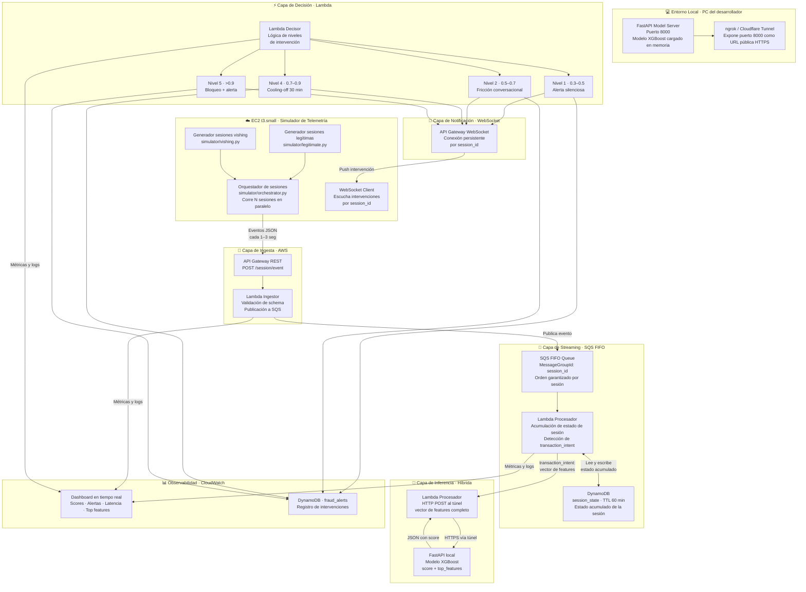

# Arquitectura Híbrida AWS v2.0 — PoC Detección de Vishing en Tiempo Real


---

## Alcance de esta iteración

Esta versión de la arquitectura prioriza tres capacidades esenciales para demostrar el funcionamiento del sistema en tiempo real:

1. **Generación de telemetría simulada** desde una instancia EC2 en la nube
2. **Ingesta y procesamiento de eventos** en AWS
3. **Inferencia en tiempo real** sobre un modelo ya entrenado, con notificación de vuelta al dispositivo

Se excluye deliberadamente el cálculo de métricas baseline por cliente y la gestión de perfiles de usuario. Las features del modelo en esta iteración son **absolutas**, no relativas a un historial individual. Esto simplifica significativamente la arquitectura sin comprometer el valor de demostración del sistema.

---

## Diagrama de arquitectura (alto nivel)



---

## Descripción de componentes

### 1. Simulador de telemetría · EC2 t3.small

**Propósito:** Genera eventos de sesión en tiempo real simulando el comportamiento de un usuario en la app MiBancolombia, incluyendo las señales biométricas que BioCatch recolectaría del dispositivo móvil. Envía cada evento individualmente al API Gateway con los delays naturales de una sesión humana.

**Por qué EC2 y no Lambda:** El simulador necesita mantener sesiones activas de hasta 30 minutos de forma continua y orquestar múltiples sesiones en paralelo. Lambda tiene un timeout máximo de 15 minutos, lo que lo descarta para este rol. EC2 también permite demostrar conocimiento de despliegue de servicios de larga duración en la nube.

**Estructura del simulador:**

```
simulator/
├── orchestrator.py      # Lanza N sesiones en paralelo con threading
├── legitimate.py        # Sesiones con comportamiento normal
├── vishing.py           # Sesiones con patrones de manipulación
└── websocket_client.py  # Conexión WebSocket para recibir intervenciones
```

**Estructura del evento JSON enviado:**

En esta iteración, el evento contiene únicamente valores absolutos de la sesión en curso — sin comparaciones contra baseline de cliente.

```json
{
  "session_id": "3f2a1b4c-uuid",
  "customer_id": "BC-10041",
  "timestamp": "2025-03-15T14:32:07.341Z",
  "event_type": "biometric_sample | screen_view | transaction_intent",
  "biometric": {
    "acelerometro_varianza_x": 0.041,
    "acelerometro_varianza_y": 0.037,
    "velocidad_tecleo_ms": 312,
    "presion_tactil": 0.71,
    "ratio_backspace": 0.18
  },
  "navigation": {
    "pantalla_actual": "IngresoMonto",
    "tiempo_en_pantalla_seg": 47,
    "num_correcciones_campo_monto": 3,
    "app_en_background_antes": true,
    "tiempo_background_seg": 22
  },
  "transaction": {
    "monto_cop": 4500000,
    "es_destinatario_nuevo": true,
    "tiempo_cuenta_destino_dias": 8
  }
}
```

---

### 2. Capa de ingesta · API Gateway REST + Lambda Ingestor

**API Gateway REST** expone el endpoint `POST /session/event`. Protegido con API key para que solo el simulador autorizado pueda enviar eventos.

**Lambda Ingestor** en esta versión simplificada ejecuta únicamente dos operaciones:

1. Valida el schema del evento (campos requeridos, tipos de datos)
2. Publica el evento directamente en SQS FIFO sin enriquecimiento adicional

Al eliminar la consulta de perfiles de cliente, esta Lambda es significativamente más rápida y simple. No hay dependencia de DynamoDB en la capa de ingesta.

```python
# Lambda Ingestor — versión simplificada
import json, boto3, os

sqs = boto3.client('sqs')
QUEUE_URL = os.environ['SQS_QUEUE_URL']

def handler(event, context):
    body = json.loads(event['body'])

    # Validación mínima de schema
    required = ['session_id', 'customer_id', 'timestamp', 'event_type']
    if not all(k in body for k in required):
        return {'statusCode': 400, 'body': 'Missing required fields'}

    # Publicar en SQS FIFO — session_id como MessageGroupId
    sqs.send_message(
        QueueUrl=QUEUE_URL,
        MessageBody=json.dumps(body),
        MessageGroupId=body['session_id'],
        MessageDeduplicationId=f"{body['session_id']}-{body['timestamp']}"
    )

    return {'statusCode': 200, 'body': 'OK'}
```

---

### 3. Capa de streaming · SQS FIFO + Lambda Procesador + DynamoDB

**SQS FIFO** recibe los eventos con `session_id` como `MessageGroupId`, garantizando que todos los eventos de una misma sesión se procesen en orden cronológico. Reemplaza a Kinesis Data Streams con un costo marginal (~$0 para el volumen de una PoC vs. ~$22/mes de Kinesis).

**Lambda Procesador** es el componente central del pipeline. Por cada evento recibido:

1. Lee el estado acumulado de la sesión desde DynamoDB `session_state`
2. Actualiza el estado con los datos del nuevo evento
3. Escribe el estado actualizado de vuelta con TTL renovado
4. Si el evento es `transaction_intent`, construye el vector de features y llama al modelo

```python
# Lambda Procesador — lógica central
def update_session_state(session_id, evento, estado_actual):
    biom = evento.get('biometric', {})
    nav  = evento.get('navigation', {})
    tx   = evento.get('transaction', {})

    # Acumulación de señales a lo largo de la sesión
    estado_actual['num_eventos'] = estado_actual.get('num_eventos', 0) + 1
    estado_actual['num_pausas_largas'] = estado_actual.get('num_pausas_largas', 0) + \
        (1 if nav.get('tiempo_en_pantalla_seg', 0) > 8 else 0)
    estado_actual['num_correcciones_monto'] = estado_actual.get('num_correcciones_monto', 0) + \
        nav.get('num_correcciones_campo_monto', 0)
    estado_actual['app_background_count'] = estado_actual.get('app_background_count', 0) + \
        (1 if nav.get('app_en_background_antes') else 0)
    estado_actual['velocidad_tecleo_promedio_sesion'] = running_average(
        estado_actual.get('velocidad_tecleo_promedio_sesion', 0),
        biom.get('velocidad_tecleo_ms', 0),
        estado_actual['num_eventos']
    )
    estado_actual['tiempo_total_seg'] = estado_actual.get('tiempo_total_seg', 0) + \
        nav.get('tiempo_en_pantalla_seg', 0)

    # Si es transaction_intent, guardar datos de la transacción
    if evento['event_type'] == 'transaction_intent':
        estado_actual['monto_cop']               = tx.get('monto_cop', 0)
        estado_actual['es_destinatario_nuevo']   = tx.get('es_destinatario_nuevo', False)
        estado_actual['tiempo_cuenta_destino']   = tx.get('tiempo_cuenta_destino_dias', 999)

    return estado_actual
```

**DynamoDB — tabla `session_state`** almacena el estado acumulado de cada sesión activa. Al eliminar los perfiles de cliente, esta es la única tabla de DynamoDB necesaria en el pipeline de procesamiento.

```
session_state (PK: session_id)
├── num_eventos                        → int
├── num_pausas_largas                  → int
├── tiempo_total_seg                   → float
├── num_correcciones_monto             → int
├── app_background_count               → int
├── velocidad_tecleo_promedio_sesion   → float
├── ratio_backspace_promedio           → float
├── monto_cop                          → float   (se llena en transaction_intent)
├── es_destinatario_nuevo              → bool    (se llena en transaction_intent)
├── tiempo_cuenta_destino_dias         → int     (se llena en transaction_intent)
├── ultimo_evento_ts                   → String
└── ttl                                → int     (Unix timestamp + 3600s)
```

---

### 4. Capa de inferencia · FastAPI local + túnel

El modelo XGBoost entrenado sobre los datasets sintéticos corre en el PC local del desarrollador y se expone vía túnel HTTPS. Cuando el Lambda Procesador detecta un evento `transaction_intent`, construye el vector de features a partir del estado acumulado en DynamoDB y hace una llamada HTTP al modelo.

**Vector de features enviado al modelo:**

En esta iteración, todos los features son absolutos — valores de la sesión en curso sin comparación contra baseline histórico del cliente.

```json
{
  "num_pausas_largas":                 6,
  "tiempo_total_seg":                  423,
  "num_correcciones_monto":            3,
  "app_background_count":              3,
  "velocidad_tecleo_promedio_sesion":  312,
  "ratio_backspace_promedio":          0.18,
  "monto_cop":                         4500000,
  "es_destinatario_nuevo":             1,
  "tiempo_cuenta_destino_dias":        8
}
```

**FastAPI model_server.py:**

```python
from fastapi import FastAPI
import joblib, numpy as np, time

app     = FastAPI()
model   = joblib.load("artifacts/vishing_model.pkl")
FEATURES = joblib.load("artifacts/feature_names.pkl")

@app.post("/predict")
def predict(features: dict):
    t0 = time.time()
    X  = np.array([[features.get(f, 0) for f in FEATURES]])
    score = float(model.predict_proba(X)[0][1])
    importances = model.feature_importances_
    top = sorted(zip(FEATURES, importances), key=lambda x: -x[1])[:5]
    return {
        "vishing_score": round(score, 3),
        "confidence":    round(max(score, 1 - score), 3),
        "top_features": [
            {"feature": f, "importancia": round(i, 3)} for f, i in top
        ],
        "latencia_ms": round((time.time() - t0) * 1000, 1)
    }
```

**Configuración del túnel:**

```bash
# Opción A — ngrok
ngrok http 8000
# URL generada → configurar como MODEL_ENDPOINT en Lambda Procesador

# Opción B — Cloudflare Tunnel (más estable)
cloudflared tunnel --url http://localhost:8000
```

---

### 5. Capa de decisión · Lambda Decisor

Recibe el score del modelo y aplica la lógica de intervención graduada. Registra cada decisión en DynamoDB `fraud_alerts`.

| Score | Nivel | Acción |
|---|---|---|
| 0.0 – 0.3 | — | Sin intervención. Log en CloudWatch. |
| 0.3 – 0.5 | Nivel 1 | Alerta silenciosa — solo registro interno |
| 0.5 – 0.7 | Nivel 2 | Fricción conversacional en app |
| 0.7 – 0.9 | Nivel 4 | Cooling-off obligatorio 30 minutos |
| > 0.9 | Nivel 5 | Bloqueo temporal + alerta de escalación |

**Payload de notificación al dispositivo:**

```json
{
  "session_id": "3f2a1b4c-uuid",
  "action":     "friction_question",
  "nivel":      2,
  "score":      0.847,
  "mensaje":    "Notamos actividad inusual en tu sesión. ¿Estás en este momento hablando por teléfono con alguien que te está guiando para hacer esta transferencia?",
  "top_features": [
    {"feature": "num_pausas_largas",        "valor": 6,       "importancia": 0.31},
    {"feature": "app_background_count",     "valor": 3,       "importancia": 0.22},
    {"feature": "num_correcciones_monto",   "valor": 3,       "importancia": 0.19},
    {"feature": "es_destinatario_nuevo",    "valor": true,    "importancia": 0.16},
    {"feature": "tiempo_cuenta_destino",    "valor": 8,       "importancia": 0.12}
  ]
}
```

---

### 6. Capa de notificación · API Gateway WebSocket

El simulador en EC2 mantiene una conexión WebSocket abierta por cada sesión activa. El Lambda Decisor hace push directo al `connectionId` correspondiente cuando determina una intervención.

Para la demo, el simulador imprime la intervención recibida en consola mostrando el nivel, el score y el mensaje — representando lo que aparecería en la pantalla del usuario en la app real.

---

### 7. Observabilidad · CloudWatch Dashboard

**Widgets del dashboard:**

- **Sesiones activas:** Score en tiempo real por sesión (verde < 0.5, amarillo 0.5–0.7, rojo > 0.7)
- **Timeline de intervenciones:** Nivel, score y session_id de cada alerta disparada
- **Latencia end-to-end:** P50 y P95 desde `transaction_intent` hasta notificación. Objetivo: < 2 segundos
- **Top features:** Los 3 features más influyentes por intervención activa

---

## Stack completo

| Componente | Servicio AWS | Costo estimado/mes |
|---|---|---|
| Simulador de telemetría | EC2 t3.small | ~$15 |
| Endpoint de ingesta | API Gateway REST | ~$1 |
| Ingestor | Lambda | ~$1 |
| Streaming | SQS FIFO | ~$0 |
| Estado de sesión | DynamoDB `session_state` + TTL | ~$1 |
| Registro de alertas | DynamoDB `fraud_alerts` | ~$1 |
| Decisor | Lambda | ~$1 |
| Notificación | API Gateway WebSocket | ~$1 |
| Modelo | FastAPI local + ngrok | ~$0 |
| Observabilidad | CloudWatch | ~$5 |
| **Total** | | **~$26/mes** |

> SageMaker (~$50), Kinesis (~$22), ElastiCache (~$12) y la tabla `customer_profiles` (~$1) se eliminan completamente en esta iteración.

---

## Fases de implementación

### Fase 1 — Esqueleto de ingesta · Semana 1

**Objetivo:** Validar que los eventos del simulador llegan correctamente a SQS sin enriquecimiento ni procesamiento adicional.

**Tareas:**
- Lanzar EC2 t3.small y desplegar el simulador para una sesión simple
- Configurar API Gateway REST con API key y endpoint `POST /session/event`
- Implementar Lambda Ingestor con validación de schema y publicación a SQS FIFO
- Crear cola SQS FIFO con `session_id` como MessageGroupId

**Validación:**
- CloudWatch Logs muestra eventos procesados correctamente
- Los mensajes llegan a SQS en orden por sesión
- El simulador puede enviar una sesión completa de 5 minutos sin errores

**Entregable:** Eventos del simulador fluyendo desde EC2 hasta SQS de forma estable.

---

### Fase 2 — Acumulación de estado y score simulado · Semana 2

**Objetivo:** Validar el feature engineering acumulativo y el flujo completo de notificación antes de conectar el modelo real.

**Tareas:**
- Implementar Lambda Procesador con acumulación de estado en DynamoDB `session_state` con TTL
- Implementar detección de evento `transaction_intent` como trigger de llamada al modelo
- Implementar Lambda Decisor con **score hardcodeado** (0.85 para sesiones vishing, 0.15 para legítimas)
- Configurar API Gateway WebSocket y conexión persistente desde el simulador en EC2
- Verificar que la intervención llega al simulador y se imprime correctamente

**Validación:**
- DynamoDB `session_state` acumula correctamente el estado de múltiples sesiones concurrentes
- La intervención llega al simulador en < 2 segundos desde el `transaction_intent`
- El TTL de `session_state` expira correctamente al finalizar cada sesión

**Entregable:** Demo funcional end-to-end con score fijo. El flujo completo de intervención es demostrable aunque el modelo no esté conectado.

---

### Fase 3 — Integración del modelo real · Semanas 3–4

**Objetivo:** Reemplazar el score hardcodeado por el modelo XGBoost entrenado sobre los datasets sintéticos.

**Tareas:**
- Entrenar modelo XGBoost sobre los datasets sintéticos con features absolutos
- Serializar modelo con `joblib` y verificar que las features coincidan con el vector construido por Lambda
- Implementar `model_server.py` con FastAPI y levantar con `uvicorn`
- Configurar túnel ngrok/Cloudflare y actualizar `MODEL_ENDPOINT` en Lambda Procesador
- Validar scores: sesiones vishing deben recibir score > 0.7 consistentemente, sesiones legítimas < 0.4

**Validación:**
- El modelo devuelve scores diferenciados y coherentes con las señales de cada sesión
- `top_features` del output son explicables en lenguaje de negocio ante stakeholders
- Latencia total (SQS → Lambda → túnel → modelo → Lambda → WebSocket) < 2 segundos

**Entregable:** Pipeline completo con modelo real funcionando. El sistema detecta correctamente las sesiones de vishing simuladas.

---

### Fase 4 — Demo pulido · Semana 5

**Objetivo:** Construir la experiencia de presentación ante el área de seguridad y tomadores de decisión.

**Tareas:**
- Configurar CloudWatch Dashboard con visualización en tiempo real
- Preparar el orquestador con 4–5 sesiones concurrentes (mix de legítimas y vishing)
- Preparar tres casos narrativos:
  - **Caso A — Sesión legítima:** Score bajo, sin intervención, sistema en modo silencioso
  - **Caso B — Vishing claro:** Score sube progresivamente, cooling-off de Nivel 4 activado
  - **Caso C — Caso ambiguo:** Score en zona gris, fricción conversacional de Nivel 2
- Documentar script de demo para que cualquier integrante del equipo pueda correrlo

**Entregable:** Demo listo para presentación con narrativa visual clara y script documentado.

---

## Guía de inicio rápido

```bash
# 1. PC local — iniciar el servidor del modelo
pip install fastapi uvicorn joblib scikit-learn xgboost numpy
uvicorn model_server:app --port 8000

# 2. PC local — exponer con ngrok
ngrok http 8000
# Copiar URL HTTPS generada

# 3. AWS — actualizar variable de entorno en Lambda Procesador
MODEL_ENDPOINT = "https://<id>.ngrok.io/predict"

# 4. EC2 — iniciar el simulador
ssh ec2-user@<ip-ec2>
cd vishing-simulator
python orchestrator.py --sessions 4 --vishing-ratio 0.5

# 5. Browser — abrir CloudWatch Dashboard y observar en tiempo real
```

---

## Evolución hacia la siguiente iteración

Una vez validada la PoC con features absolutos, la siguiente iteración natural incorpora los perfiles de cliente para hacer el modelo más robusto:

| Capacidad | Esta iteración | Siguiente iteración |
|---|---|---|
| Features del modelo | Valores absolutos de la sesión | Desviaciones vs. baseline por cliente |
| Perfiles de cliente | No requerido | DynamoDB `customer_profiles` |
| Enriquecimiento en ingesta | Solo validación de schema | Cálculo de desviaciones relativas |
| Poder predictivo | Señal clara con datos sintéticos sesgados | Señal más robusta y generalizable |

La arquitectura está diseñada para que esta evolución sea aditiva — se agregan componentes sin modificar los existentes.

---

*Área de Innovación · Arquitectura de Innovación · Documento de referencia técnica · 2025*
